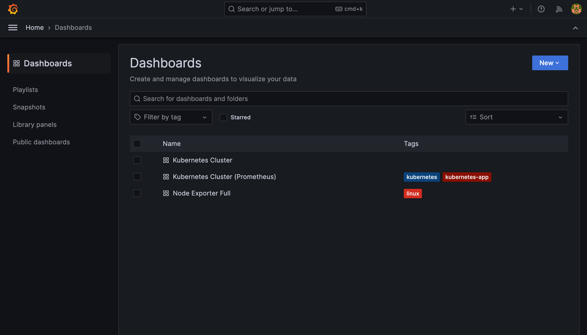
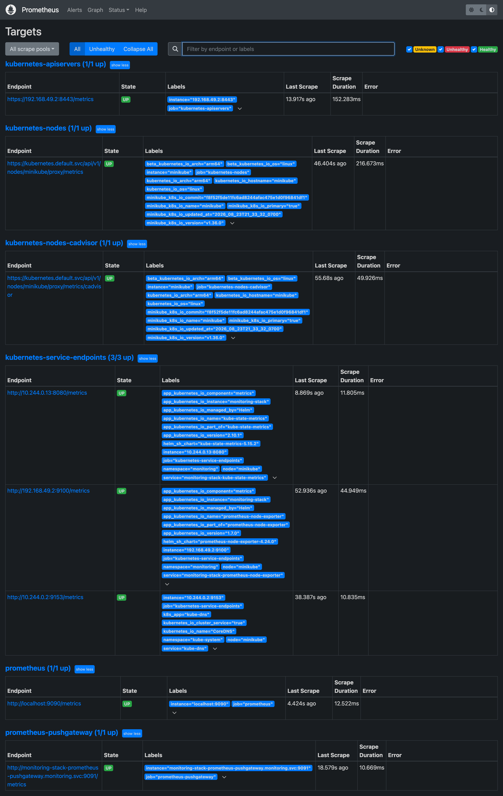
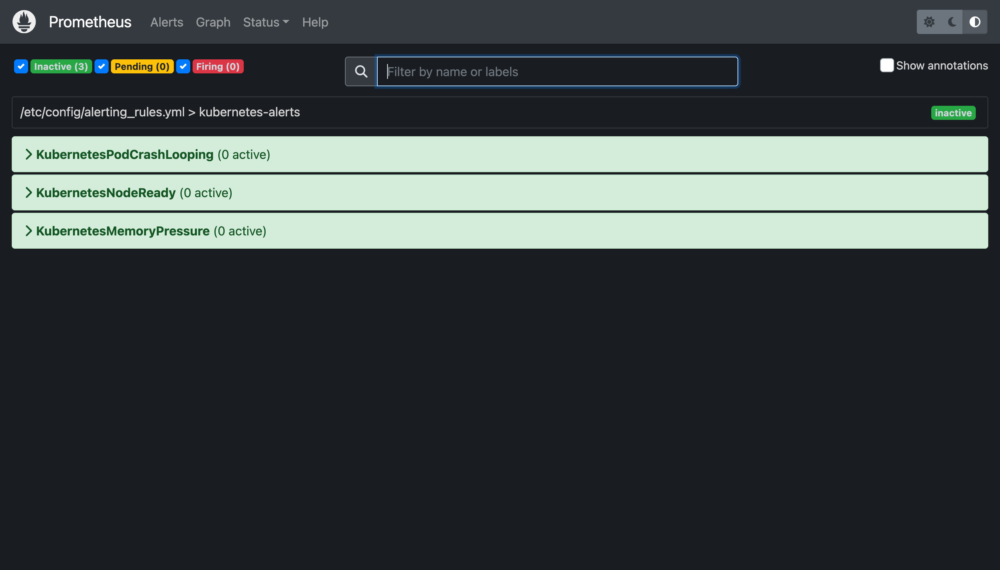
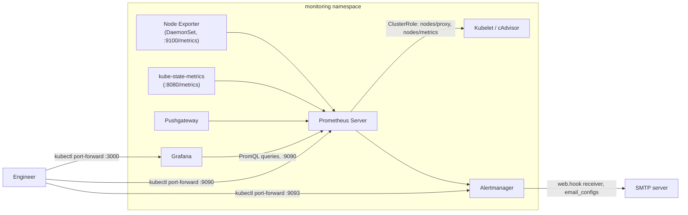

# Kubernetes Monitoring Stack: Prometheus, Grafana, Alertmanager

[](https://github.com/soodrajesh/Kubernetes-Prometheus-Grafana-Monitoring/actions/workflows/ci.yml)

A Helm chart that deploys Prometheus, Grafana, and Alertmanager onto a Kubernetes cluster, plus the RBAC, network policies, and service monitors needed to run them. I built this so I'd stop hand-rolling `kubectl apply` sequences every time I needed a monitoring stack on a cluster - it wraps the upstream community charts instead of reinventing scrape configs and dashboards.

Every screenshot below is `helm install` run for real against a live minikube cluster — not a mockup. Doing that live is also how the two bugs below got found and fixed, and how the dashboard gap below got diagnosed instead of guessed at.



<details>
<summary>Prometheus and Alertmanager (click to expand)</summary>

**Targets** — every scrape target `UP`, confirming the RBAC and service discovery actually work:



**Alert rules** — the three baked-in rules loaded and evaluating (green = inactive, which is correct on a healthy cluster):



</details>

## What this deploys

- **Prometheus server** (via the `prometheus-community/prometheus` chart) - scrapes metrics and evaluates alert rules
- **Node Exporter** and **kube-state-metrics** - shipped as part of the Prometheus chart dependency, giving host-level and Kubernetes-object-level metrics
- **Pushgateway** - for batch/cron job metrics that can't be scraped directly
- **Grafana** (via the `grafana/grafana` chart) - reads from Prometheus and ships with three community dashboards pulled by ID (cluster overview, pod monitoring, node-exporter-full)
- **Alertmanager** (via the `prometheus-community/alertmanager` chart) - deployed as its own dependency, with a single email receiver configured
- Custom RBAC (`ClusterRole`/`ClusterRoleBinding` for Prometheus to read nodes/pods/services and scrape `/metrics` and `/metrics/cadvisor`), optional `NetworkPolicy` resources, and `ServiceMonitor` CRs layered on top in `helm/monitoring-stack/templates/`

## Project structure

```
Kubernetes-Prometheus-Grafana-Monitoring/
├── LICENSE
├── README.md
├── SECURITY.md
├── helm/
│   └── monitoring-stack/          # the umbrella chart
│       ├── Chart.yaml             # declares prometheus, grafana, alertmanager as dependencies
│       ├── values.yaml            # sizing, storage, alert rules, dashboards, credentials
│       └── templates/
│           ├── _helpers.tpl
│           ├── rbac.yaml          # ServiceAccount + ClusterRoles for prometheus/grafana
│           ├── network-policy.yaml # pod-to-pod restrictions (disabled by default)
│           └── servicemonitor.yaml # ServiceMonitor CRs for prometheus/grafana/alertmanager
└── scripts/
    ├── deploy.sh                  # helm repo add + install/upgrade/uninstall/status
    └── backup.sh                  # dumps grafana + prometheus data and configmaps
```

## Architecture



I went with an umbrella chart that pulls in the upstream `prometheus-community/prometheus`, `grafana/grafana`, and `prometheus-community/alertmanager` charts as dependencies (pinned to specific versions in `Chart.yaml`) rather than writing Prometheus/Grafana manifests from scratch. That keeps me off the hook for tracking upstream config schema changes and lets me focus the custom code in this repo on the RBAC, network policy, and service monitor layer that's actually cluster-specific. Storage is a real cost/durability tradeoff I made explicit in `values.yaml`: Prometheus gets 50Gi with 15 days of retention, Grafana gets 10Gi, Alertmanager gets 2Gi, and the storage class defaults to `gp2` (EBS) but is overridable via `global.storageClass` for other providers. Resource requests/limits are set per-component rather than left blank, based on rough sizing for a small-to-medium cluster - they're not tuned against real workload data, just reasonable starting points to edit.

Three baseline alert rules (pod crash-looping, node not-ready, node memory pressure) are baked directly into `values.yaml` under `prometheus.serverFiles.alerting_rules.yml` rather than shipped as a separate `PrometheusRule` CRD, since this deployment doesn't run the Prometheus Operator - it's the standalone server chart. That decision has a real consequence, covered below.

## Deploying

Prerequisites: a Kubernetes cluster (v1.20+), Helm 3, `kubectl` pointed at the right context, and a storage class if you're not on EKS/gp2.

```bash
git clone https://github.com/soodrajesh/Kubernetes-Prometheus-Grafana-Monitoring.git
cd Kubernetes-Prometheus-Grafana-Monitoring

# fetch the chart dependencies (prometheus, grafana, alertmanager) - not vendored in this repo
helm dependency update ./helm/monitoring-stack

./scripts/deploy.sh deploy
```

`scripts/deploy.sh` adds the `prometheus-community` and `grafana` Helm repos, creates the `monitoring` namespace if it doesn't exist, and installs (or upgrades) the release named `monitoring-stack`. It also supports `./scripts/deploy.sh status` and `./scripts/deploy.sh uninstall`.

If you'd rather run it by hand:

```bash
kubectl create namespace monitoring
helm install monitoring-stack ./helm/monitoring-stack -n monitoring
```

### Access

Everything is `ClusterIP` by default - there's no ingress or LoadBalancer wired up, so port-forward is the way in:

```bash
kubectl port-forward -n monitoring svc/monitoring-stack-grafana 3000:80        # http://localhost:3000, admin/admin123
kubectl port-forward -n monitoring svc/monitoring-stack-prometheus-server 9090:80
kubectl port-forward -n monitoring svc/monitoring-stack-alertmanager 9093:9093 # not :80 — this Service's port is 9093, verified live
```

Service names come from the Helm release name (`monitoring-stack`) plus each subchart's naming convention - run `kubectl get svc -n monitoring` after install to confirm the exact names on your cluster before scripting against them.

### Backup

```bash
./scripts/backup.sh
```

Dumps Grafana's dashboard export and `/var/lib/grafana` data, a Prometheus data directory snapshot, ConfigMaps, and a redacted Secrets structure into a timestamped folder under `./backups/`. It shells into the running pods with `kubectl exec`/`kubectl cp`, so it only works while the stack is up - there's no scheduled/automated backup (no CronJob, no off-cluster storage target).

## Deliberately out of scope

- No TLS anywhere — Grafana, Prometheus, and Alertmanager are all plain HTTP behind `ClusterIP`, port-forward only.
- Alertmanager isn't wired to Prometheus in `values.yaml` — the 3 baked-in alert rules evaluate but never reach Alertmanager for routing.
- Two of the three bundled Grafana dashboards render `N/A` against this chart's own scrape config — metrics are genuinely flowing (verified live, every target `UP`), it's a job-label naming mismatch between this chart's Kubernetes-SD scrape config and what those dashboards' template variables expect, not an outage.

## License

MIT - see [LICENSE](LICENSE).
